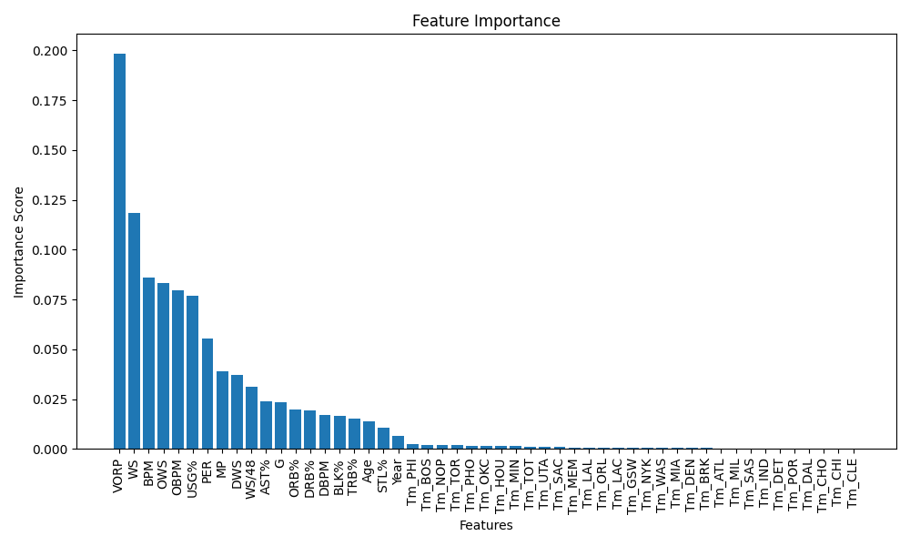

# NBA Best Players Prediction

The goal of this project is to predict the best NBA players based on their statistics.

The data is scraped from the [Basketball Reference](https://www.basketball-reference.com/) website using the BeautifulSoup library. Player stats are then cleaned, preprocessed using the Pandas library, and stored in CSV files in the [data](data/) directory. Addional properties are added to the data:

- ANBA: if the player was an All-NBA player,
- RK: if the player was a rookie,
- ANBARK: if the player was an All-NBA player in their rookie year,
- Year: the year the data was collected.

The following features are available for each player:

```csv
            Player Pos  Age   Tm   G    MP   PER  ORB%  DRB%  TRB%  AST%  STL%  BLK%  USG%  OWS  DWS   WS  WS/48  OBPM  DBPM  BPM  VORP  ANBA  RK  ANBARK  Year
0        Ömer Aşık   C   31  TOT  18   182   3.1   5.5  22.2  14.0   2.1   0.5   1.9   8.7 -0.2  0.2 -0.1 -0.021  -6.5  -1.5 -8.0  -0.3     0   0       0  2018
1     Luke Babbitt  SF   28  TOT  50   715   9.8   1.1  13.9   7.5   6.5   0.5   0.8  15.0  0.5  0.4  0.9  0.060  -0.9  -1.5 -2.4  -0.1     0   0       0  2018
2  Marco Belinelli  SG   31  TOT  80  1947  14.1   1.1   7.3   4.3  11.9   1.6   0.5  20.7  2.4  1.3  3.7  0.092   0.4  -0.8 -0.5   0.8     0   0       0  2018
```

The data is then used to train a Random Forest model using the Scikit-learn library.

Only a select number of features are used to train the model. Those were selected based on their importance in predicting the best players.

<br>
<div align="center">
  
  <br><br>
  <em>Feature importances of each feature in the Random Forest model.</em>
</div>
<br>

Based on the that information, the following features were selected:

```python
selected_features = [
    "VORP",
    "WS",
    "OWS",
    "BPM",
    "OBPM",
    "USG%",
    "PER",
    "DWS",
    "MP",
    "WS/48",
]
```

After training the model, the best players are predicted based on the data from the 2024 season. The results are stored in the JSON file.

## Usage

To run the project, first install the required dependencies:

```python
pip install -r requirements.txt
```

Then run the following command:

```python
python Kajdan_Ignacy.py output.json
```

## License

This repository is licensed under the MIT License - see the [LICENSE](LICENSE.md) file for details.
